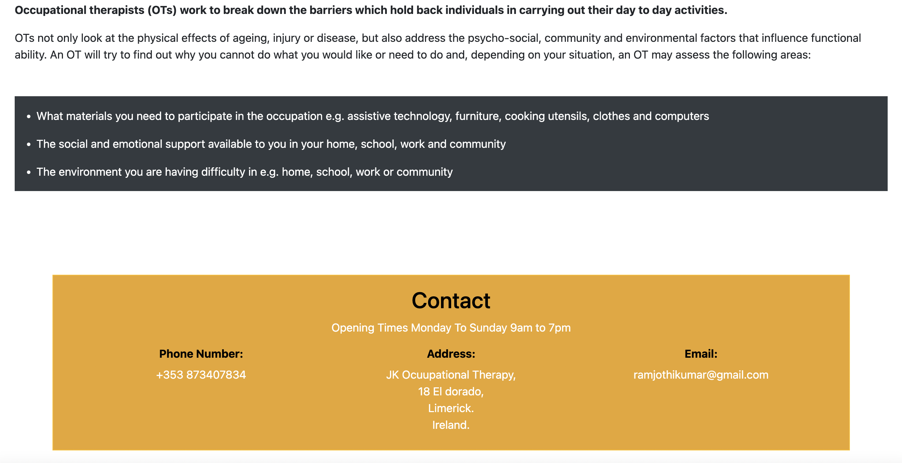

# JK Occupational Therapy
Occupational Therapy helps people to participate in everyday meaningful activities.Occupational Therapists work with people of all ages, helping them to carry out the activities that they need or want to do in order to lead healthy and fulfilling lives.Occupational therapists (OTs) work to break down the barriers which hold
back individuals in carrying out their day to day activities. When the assessment is complete the occupational therapist will work with the patient to identify goals that Occupational Therapy can help to achieve. They will listen to what is important to you and see if they can either, help restore your ability to do your everyday occupations, or find another way of achieving your goal.

[click here to view the site](
)
# Table of contents
- [Vision](#vision)
- [User Experience](#user-experience)
    - [The target audience](#target-audience)
    - [User's journey](#user's-journey)
    - [Admin's journey](#user's-journey)
- [Website Structure](#website-structure)
    - [Features](#features)
    - [Logo](#logo)
    - [Navigation](#navigation)
    - [Home](#home)
    - [About](about)
    - [What we do](#what-we-do)
    - [Footer](#footer)
- [Technologies Used](#technologies-used)
    - [Languages Used](#languages-used)
    - [Libraries/Framework Used](#librariesframework-used)
    - [Other Technologies](#other-technologies)

- [Future Features](#future-Features)
- [Website Surface](#website-Surface)
    - [Wireframes](#wireframes)
    - [Design Choices](#design-Choice) 
    - [Colour Scheme](#colour-Scheme)
    - [Typography](#typography)
- [Testing](#testing)
    - [Code validation](#code-Validation)
    - [Manual testing](#manual-testing)
    - [Bug fixing](#bug-fixing)
- [Technology Used](#technology-Used)
- [Deployment](#deployment)
- [Credits](#credits)
- [Acknowledgement](#acknowledgement)
____

# Vision
The aim of this project is to create a website for the Occupational therapy with an intention to assist the patient for their day to day activities. This is for elderly people who nedd OT service.
# User experience
## The target audience
The target audience are the Elderly people, general public, gp, allied health professional, Consultant.

## User's journey
A user should go through the site like a purposeful journey and to ensure this,

- The user needs to quickly know the purpose on the site.
- The user should be able to spontaneously and easily navigate through the site.
- The user will know about, What is Occupational Therapy is?, How do they approach the patients, What are the services they do.
- The user will get to book an appointment for assesment and visit the OT. 
- The user will know about the skills of the OT, qualifications, profile, experience and credentials.
- The user will be able to get the required information within a short span of time.
- The user will find the information in plain and common language..
- The user will find options to contact the team and to make an inquiry and cancelation.

## Admin Stories 
- As a site admin I would like to create html file which contains header/nav and footer for multiple pages.
- As a site admin I would to patience directly book the appointment without login or signin.
- As a site Admin I would like to redirect users to manage booking page after they submit an appointment form so they can see if their appointment is approved or not.
- As a site Admin I would like to add, edit and delete which will not allow the user to change or update appointment details once the appointment has been approved.

# Website structure
## Features
- The site has a header navbar with logo and footer.

- The site has three pages which are easy to navigate.

- Homepage gives information about the Occupational service.

- The About us page gives detailed information and credentials about the Occupational Therapist.

- What we do page gives meticulous service and assessment of the OT.

- When an appointment is booked, they get a succes note.

## Logo
- The logo has a symbol which denotes the namwe of the Therapist.

## Navigation
- The navigation, header and footer are similar for all the pages.
- The navigation is enabled for all screens such as desktop to mobile.
- The navigation is placed on the left corner of the navbar.

## Home
- The home page is aimed to give all details about the Ocupational THerapy.
- The home page starts with a picture of Occupational therapy.
- The home page has contact details.

## About
- About pages gives meticulous note of the Occupational therapist and his regardless work.

- The About us page introduces the therapist with four distinctive work complexity and flexibility  approach towards his work and patients.

- Below the pictures, a detailed profile is presented about the OT to give a background, qualification and honors, versatile experience in his work, work experience and the development of the services.
 

## Footer
- The footer is the same on all the three pages.
- The footer has social media links.
- To enable better user experience each social media link in the footer opens in a new tab.

)

## Technologies Used

  * ## Languages Used
    * [HTML](https://www.w3schools.com/html/)
    * [CSS](https://www.w3schools.com/css/)
    * [Javascript](https://en.wikipedia.org/wiki/JavaScript)
    * [Python](https://www.python.org/)

    * ## Libraries/Framework Used
        * [Django](https://www.djangoproject.com/)
        * [Bootstrap](https://getbootstrap.com/)

    * ### Libraries/Module Installed
        * asgiref==3.5.2
        * backports.zoneinfo==0.2.1;python_version<"3.9"
        * dj-database-url==1.0.0
        * Django==4.1.1
        * gunicorn==20.1.0
        * psycopg2-binary==2.9.3
        * pylint-django==2.5.3
        * pylint-plugin-utils==0.7
        * sqlparse==0.4.2
        * cloudinary==1.26.0
        * dj3-cloudinary-storage==0.0.5
        * django-bootstrap-datepicker-plus==4.0.0
        * django-bootstrap4==22.2
        * django-crispy-forms==1.14.0
        * django-phonenumber-field==7.0.0
        * phonenumbers==8.12.56

    * ## Other Technologies
        * [Postgres Database](https://www.postgresql.org/)
        * [W3School](https://www.w3schools.com/)
        * [Git](https://git-scm.com/)
        * [Github](https://github.com/)
        * [Gitpod workspace](https://gitpod.io/workspaces)
        * [Heroku](https://dashboard.heroku.com/apps)
        * [coolors](https://coolors.co/)
        * [jshint](https://jshint.com/)
        * [HTML code validator](https://validator.w3.org/)
        * [CSS code validator](https://jigsaw.w3.org/css-validator/)
        * [Font Awsome](https://fontawesome.com/)
        * [Google Fonts](https://fonts.google.com/)
        * [Slack](https://slack.com/intl/en-gb/)

# Future Features
- A login section could be added to allow students to access dance information.
- Dance resources and history could be added in the resources page.
- The gallery could be made as a separate page and it could contain video performances of students.
- A secure payment section can be added to allow online fee payment.
- The syllabus can be added for students for their reference.

# Website Surface

### Desktop
- [Home](/readme-images/home-d.png)
- [About](/readme-images/about-desk.png)
- [contact](/readme-images/contact-d.png)

### Mobile
- [Home](/readme-images/home-m.png)
- [About](/readme-images/about-m.png)
- [Contact](/readme-images/contact-m.png)

## Design Choices
### Colour Scheme

### Typography
There were two fonts used in this website. [Playfair](https://fonts.google.com/specimen/Playfair+Display) font was used for body and header. [Inria Serif](https://fonts.google.com/specimen/Inria%20Serif)  font was used for the navigation menu.

# Testing
## Code validation
### Html

### Css

## Light house
### Desktop

### Mobile 

## Responsive testing
Responsiveness was checked using Google Chrome Dev Tools, desktop, mobile, tablet and laptop for all screen sizes with optimum resolutions.
## Accessibility testing

## Manual testing
Manual testing was carried out in addition to automated process.

I did a manual test to verify that the website functions well in various browsers like Safari, Google Chrome and Firefox.

I manually tested the functions of navigation menu, header, all the three pages, pictures in the gallery, contact form submission with a response and footer links are working at optimised level.

## Bug fixing

On Gitpod terminal, I couldn’t git commit and push my work. After a few unsuccessful attempts I reached my tutor who kindly helped me to fix conflicts in index.html and style.css by accepting current changes.

On HTML validation I got a prompt that a section is lacking a Heading. I followed the instructions and used h1 elements to fix the issue.

# Technology Used
- HTML5 - designs the structure and content for the website.
- CSS3 - presents the style for the website.
- [canva](https://www.canva.com/) - a graphic design App was used to design the art border on the home page and to edit the pictures used in the website.
- [wix](www.wix.com) software was used to design the symbol and the texts in the logo.

- [PicResize](https://picresize.com/) tool was used to resize and crop the pictures used in this website.

- [Balsamiq](https://balsamiq.com/) was used to create wireframes.

- [Google-fonts](https://fonts.google.com/) were used to select the fonts for the site.

- [FontAwesome](https://fontawesome.com/kits/deb0a1425e/use?welcome=yes) was used for the icons in the footer.
Bootstrap was used to style and design the contact page.

# Deployment
* Git and GitHub are used for version control. Django Python is the backend language, and can't be displayed with GitHub alone, To live preview my project, I used Heroku.

* ## Heroku
    * ### Deployment Steps On Heroku.
        * In my project i've used Django v3.2, so I used this command `pip3 install 'django<4' gunicorn` to install django.
        * So inside the terminal added these libraries:  
        `pip3 install dj_database_url psycopg2`,  
        `pip3 install dj3-cloudinary-storage`
        * Created requirements.txt file where I can save all the libraries i've installed:  
        `pip3 freeze --local > requirements.txt`
        * To create my project typed this command:  
        `django-admin startproject dentist`
        * To create my app:  
        `python3 manage.py startapp booking_app`

        * to make this app work, Into the setting.py file inside `INSTALLED_APPS` added `booking_app`
        * to migrate changes typed this command:  
        `python3 manage.py migrate`
        * to run the test if the project is working `python3 manage.py runserver`

        * When deploying for the first time on Heroku, you must first register with Heroku.
        * Create your project name and location.
        * To add Database into the app, Locate in the Resources Tab, Add-ons, search and add 'Heroku Postgres'
        * Copy DATABASE_URL value, by going into the Settings Tab, click reveal Config Vars, Copy Text
        * In your workspace Create new env.py file.
        * Import os library:  
            `import os`
        * Set environment variables:  
            `os.environ["DATABASE_URL"] = "Heroku DATABASE_URL"`
        * Add in secret key:  
            `os.environ["SECRET_KEY"] = "mysecretkey"`
        * Add Secret Key to Config Vars in Heroku settings:  
            `SECRET_KEY, "mysecretkey"`

        * Add env.py file to the settings.py file:  
            `import os`  
            `import dj_database_url`

            `if os.path.isfile("env.py"):`  
                `import env`
        * Remove the insecure secret key and replace - links to the SECRET_KEY variable on Heroku:  
            `SECRET_KEY = os.environ.get('SECRET_KEY')`

        * Comment out the old DATABASES variable in setting.py file and add this instead:  
            `DATABASES = { 'default': dj_database_url.parse(os.environ.get("DATABASE_URL"))}`

        * Save all files and Make Migrations:  
            `python3 manage.py migrate`

        * Make account with Cloudinary To get static and media files.
        * From Cloudinary Dashboard, Copy your `CLOUDINARY_URL`:  
        * Add Cloudinary URL to env.py file:  
            `os.environ["CLOUDINARY_URL"] = "cloudinary://************************"`

        * Add Cloudinary URL to Heroku Config Vars:  
            `"cloudinary://************************"`

        * Temperoily add DISABLE_COLLECTSTATIC inside the heroku config Vars:  
            `DISABLE_COLLECTSTATIC, 1`

        * Add Cloudinary Libraries to settings.py installed apps:  
            `INSTALLED_APPS = ['cloudinary_storage', 'django.contrib.staticfiles', 'cloudinary']`

        * in the settings.py file under the `STATIC_URL = 'static/'` add:  
            `STATICFILES_STORAGE = 'cloudinary_storage.storage.StaticHashedCloudinaryStorage'`  
            `STATICFILES_DIRS = [os.path.join(BASE_DIR, 'static')]`  
            `STATIC_ROOT = os.path.join(BASE_DIR, 'staticfiles')`  

            `MEDIA_URL = '/media/'`  
            `DEFAULT_FILE_STORAGE = 'cloudinary_storage.storage.MediaCloudinaryStorage'`  

        * Place under the BASE_DIR line in settings.py:  
            `TEMPLATES_DIR = os.path.join(BASE_DIR, 'templates')`

        * Change the templates directory to TEMPLATES_DIR Place within the TEMPLATES array:  
            `TEMPLATES = [{'DIRS': [TEMPLATES_DIR],],},},]`

        * Add Heroku Hostname to ALLOWED_HOSTS:  
            `ALLOWED_HOSTS = ["hash-dental-care.herokuapp.com", "localhost"]`

        * Create 3 new folders on top level directory:  
            media, static, templates

        * Create Procfile on the top level directory and inside the file add this:  
            `web: gunicorn dentist.wsgi`
        
        * before deploying on heroku make sure: 
            `DEBUG = False`
            Remove `DISABLE_COLLECTSTATIC` from the config vars.

# Credits

- All images in Gallery and About us page of the website were from our Dance school’s archive and I like to give credits to my students and their parents for giving me the consent to use the pictures for this website.

- I learned a lot online via a few YouTube channels, Code, .

- I like to give credits the project by Code Institute and it is a wonderful resource for budding developers.
 
# Acknowledgement

I would like to extend my sincere thanks to my mentor, my tutor, cohort facilitator, our cohort members, the slack community and The Code Institute for all the support I received to design and develop the website in conjunction with Full Stack Software Developer Diploma course (e-commerce) at the Code Institute.
